# Employee Training Tracker

The Employee Training Tracker is a user-friendly command-line application developed using Python. It allows
users to manage employee training records stored in Google sheets through an easy to use terminal interface.
The application is designed for HR team and managers to keep track of employees training without having to 
edit the Google Sheets manually.

Users can:
- add new training records
- view all records
- search employee records
- analyse training progress
- delete records

The Employee Training Tracker program is written using python and is deployed on heroku using Node.js.
Below is an image of the Mock terminal:

# Live Project
**Live application:**  
[Live Application](https://employee-training-tracker-952185589660.herokuapp.com/)

## Contents

- [Overview](#overview)
- [User Experience UX](#user-experience-ux)
  - [User Stories](#user-stories)
  - [Project Goals](#project-goals)
- [Features](#features)
  - [Main Menu](#main-menu)
  - [Add Training Record](#add-training-record)
  - [View Records](#view-records)
  - [Search Records](#search-records)
  - [Analyse Records](#analyse-records)
  - [Delete Records](#delete-records)
  - [Input Validation](#input-validation)
  - [Google Sheets Integration](#google-sheets-integration)
- [Data Model](#data-model)
- [Flowchart](#flowchart)
- [Testing](#testing)
  - [Manual Testing](#manual-testing)
  - [PEP8 Validation](#pep8-validation)
  - [User Story Testing](#user-story-testing)
  - [Bugs Encountered and Fixes](#bugs-fixes)
  - [Remaining Bugs](#remaining-bugs)
- [Technologies Used](#technologies-used)
- [Deployment](#deployment)
- [Future Features](#future-features)
- [Credits](#credits)
- [Acknowledgements](#acknowledgements)
- [Author](#author)

## Overview

The aim of this project was to develop a simple and practical command-line application that demonstrates
the use of Python for data management. The application integrates with Google Sheets to store employee 
training records, allowing users to manage training information through an interactive terminal interface.
It demonstrates key programming concepts including functions, input validation, loops, conditional statements,
data handling, and external API integration.

## User Experience UX

The application was designed with simplicity and ease of use in mind. As a terminal-based application,
users interact through a clear menu system and receive straightforward instructions throughout the programme.

The application focuses on:
- A simple and intuitive menu.
- Clear prompts and confirmation messages.
- Input validation to reduce user errors.
- Easy navigation between features.
- Readable output using consistent formatting.

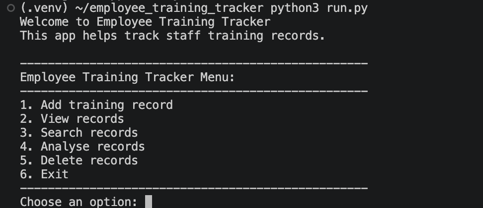

## Features

The Employee Training Tracker includes the following features:

- **Add Training Record** – Allows users to add a new employee training record to Google Sheets.
  For example, Users can add a new employee training record by entering the employee name, training name and training status.

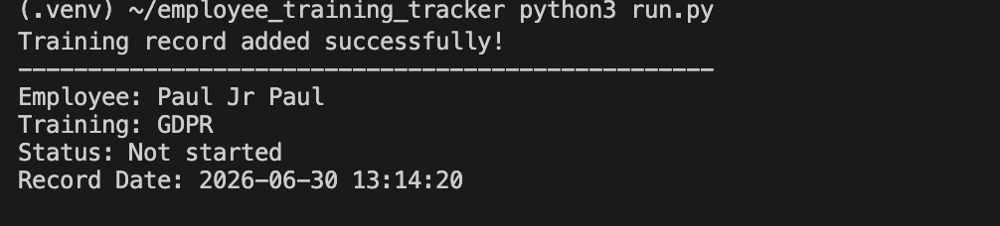

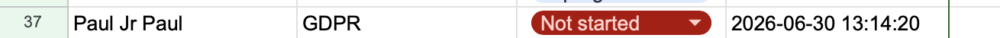

All other added records in Google Sheets.
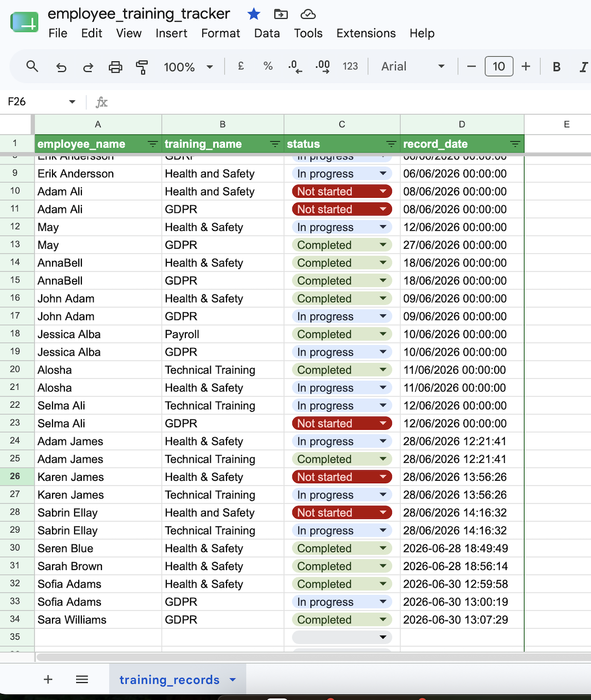

- **View Records** – Displays all stored training records.

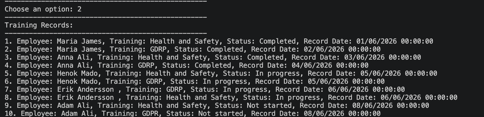

- **Search Records** – Searches for an employee's training record by name.

Search Records:

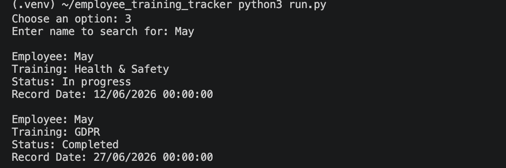

- **Analyse Records** – Calculates and displays training statistics and completion percentages.

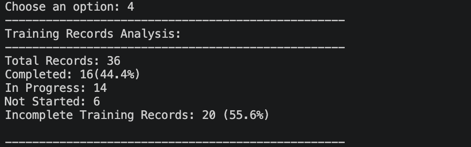

- **Delete Records** – Removes selected training records from both the application and Google Sheets.

Delete successfully record

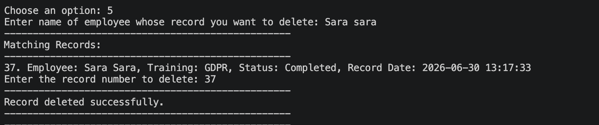

- **Input Validation** – Prevents empty inputs and validates training status before saving data.

Invalid Menu Choice Validation

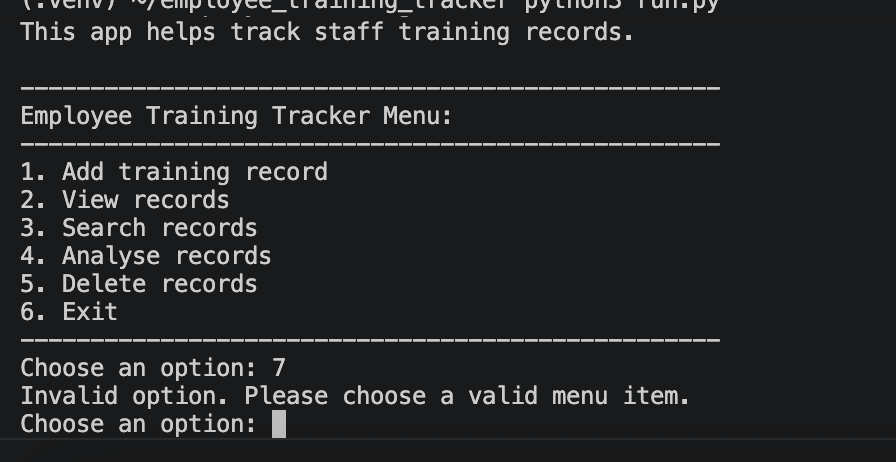

Invalid Employee Input Validation:

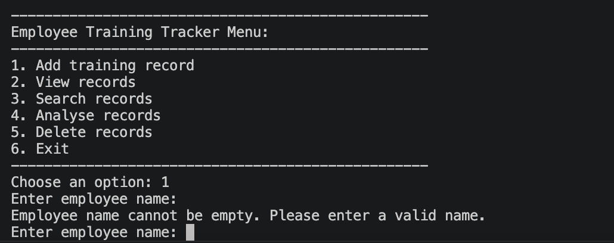

Invalid Training name input Validation:

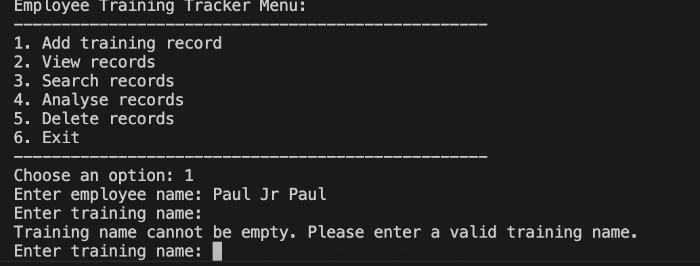

Invalid status: validation

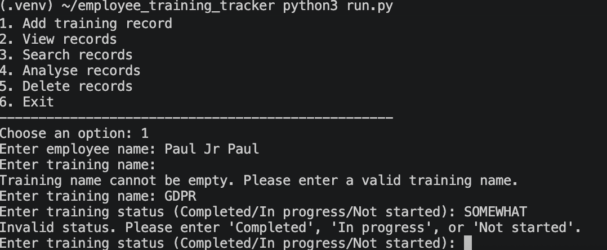

Invalid Search: Validation 

Search not found
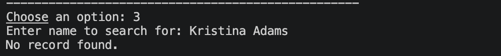

Delete validation

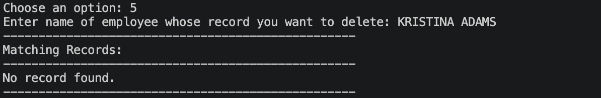

## Data Model

The application stores all training records in a Google Sheets spreadsheet using the `gspread` library.

Each record contains four fields:

| Field         |       Description           |
|---------------|-----------------------------|
| Employee Name | The employee's full name. |
| Training Name | The name of the completed or assigned training. |
| Status        | The training status (Completed, In Progress or Not Started). |
| Record Date   | The date and time the record was created. |

Each row in the spreadsheet represents a single training record and is synchronised with the application whenever records are added, viewed, searched or deleted.

## Flow Chart

In the creation of the Employee Training Tracker program, I created a flowchart to show the overall workflow and its programme logic.
Below is an image of the flowchart:

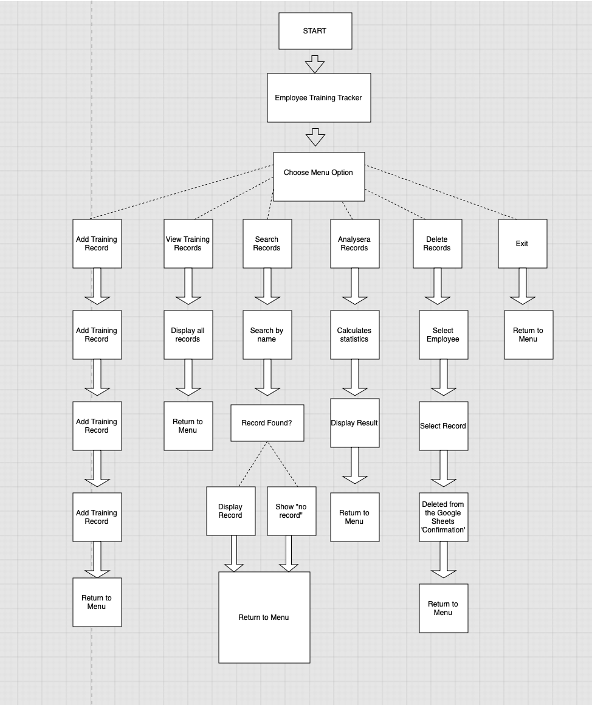

## Testing

Testing was used to ensure quality and correct coding in order to create a functioning programme for our user's experience.
It includes manual testing, PEP8 validation, User story testing and testing for bugs.

Please refer to [**_here_**](TESTING.md) for more information on testing the programme.

[Back to top](#contents)

## Technologies Used

### Programming Language
- Python 3

### Libraries 
- gspread - Used to read, write and delete data.
- google-auth - Used to authenticate the application with Google Sheets.
- datetime - Used to automatically record the date and time of each training record that is created.

### APIs
- Google Sheets API

### Development Tools
- Visual Studio Code
- GitHub
- Git
- Heroku
- Google Cloud Platform

### Python Packages
- Autopep8 - Used to format the code according to PEP 8 Guidelines.
- Pylance - Used for code analysis and IntelliSense during development. 

### Validation
- CI Python Linter (PEP8)

### Other

- diagrams.net (flowchart)

[Back to top](#contents)

## Deployment

This project was deployed to Heroku using the following steps:

- Sign in to your Heroku account.
- Select **New** and choose **Create new app**.
- Enter a unique application name and select the appropriate region.
- Click **Create app**.
- Open the **Settings** tab.
- Under **Config Vars**, add:
 - 'PORT' with the value '8000'.
 - 'CREDS' with the value of the content of the 'creds.json' file.
- Under **Buildpacks**, add:
 - Python
 - Node.js
- Open the **Deploy** tab.
- Choose **GitHub** as the deployment method.
- Connect the GitHub repository that contains the project.
- Click **Deploy Branch**
- Once the deployment is complete, click **Open App** to launch the application. 

  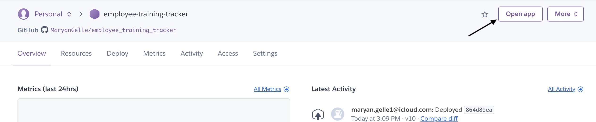

 

## Future Features

Future improvements that could be added to the application include:
- Edit an existing training record instead of deleting or re-entering the data.
- Filter the training record according to training status.
- Sort records alphabetically or by training date.
- Generate more detailed statistics or charts to help monitor the data.
- Add user authentication for security reasons so only authorised users can manage the data.

## Credits

Below you will find credit references to my sources for content, media and feedback.

- Code Institute Python Essentials template.
- Code Institute mock terminal template for Heroku deployment.
- Google Sheets API and the gspread Python library were used to store, retrieve and manage data.

Others
- diagrams.net (flowchart)

## Acknowledgments 

- My Code Institute mentor for their guidance, encouragement and valuable feedback throughout the project.
- The Code Institute tutors and Student Care for their support during the development of this project.
- My family and friends for testing the application and providing valuable feedback.

## Author
This command-line application was made by Maryan Gelle (Developer) as a Project 2 Python for my FullStack Programme at Code Institute in 2026.

