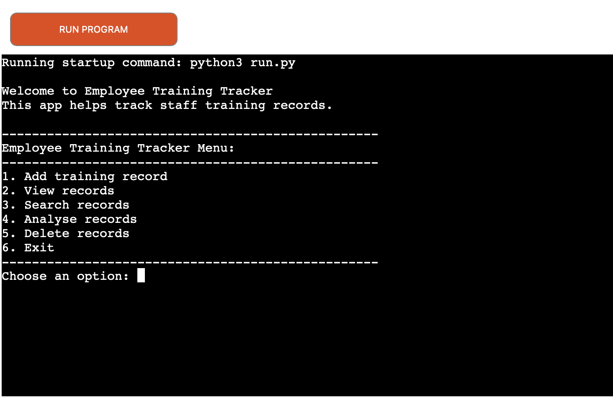

# Employee Training Tracker

The Employee Training Tracker is a userfriendly command-line application developed using Python. It allows
users to manage employee training records stored in Google sheets through an easy to use terminal interface.
The application is designed for HR team and managers to keep track of employees training without having to 
edit the Google Sheets manually.

Users can:
- add new training records
- view all records
- search employee records
- analyse training progress
- delete records

The Empployee Training Tracker program is written using python and is deployed on heroku using Node.js.
Below is an image of the Mock terminal:

  

# Live Project
**Live application:**  
[Live Application](https://employee-training-tracker-952185589660.herokuapp.com/)

## Contents

- [Overview](#overview)
- [User Experience UX](#user-experience-ux)
  - [User Stories](#user-stories)
  - [Project Goals](#project-goals)
- [Features](#features)
  - [Main Menu](#main-menu)
  - [Add Training Record](#add-training-record)
  - [View Records](#view-records)
  - [Search Records](#search-records)
  - [Analyse Records](#analyse-records)
  - [Delete Records](#delete-records)
  - [Input Validation](#input-validation)
  - [Google Sheets Integration](#google-sheets-integration)
- [Data Model](#data-model)
- [Flowchart](#flowchart)
- [Testing](#testing)
  - [Manual Testing](#manual-testing)
  - [PEP8 Validation](#pep8-validation)
  - [Solved Bugs](#solved-bugs)
  - [Remaining Bugs](#remaining-bugs)
- [Technologies Used](#technologies-used)
- [Deployment](#deployment)
- [Future Features](#future-features)
- [Credits](#credits)
- [Acknowledgements](#acknowledgements)
- [Author](#author)

## Overview

## User Experience UX

## Features

## Data Model

## Flow Chart

## Testing

## Technologies Used

## Deployment

## Future Features

Future improvements that could be added to the application include:
- Edit an existing training record instead of deleting or re-entering the data.
- Filter the training record according by training status.
- Sort records alphabetically order or by training date.
- Generate more detailed statistics or charts to help monitor the data.
- Add user authentication for security reasons so only authorised users can manage the data.

## Credits

Below you will find credit references to my sources for content, media and feedback.

- Code Institute Python Essentials template.
- Code Institute mock terminal template for Heroku deployment.
- Google Sheets API and the gspread python library was used to store, retrieve and manage data.

## Acknowledgments 

- My Code Institute mentor for their guidance, encouragement and valuable feedback throughout the project.
- The Code Institute tutors and Student Care for their support during the development of this project.
- My family and friends for testing the application and providing valuable feedback.

## Author
This command-line application was made by Maryan Gelle (Developer) as a Project 2 Python for my FullStack Programme at Code Institute in 2026.

