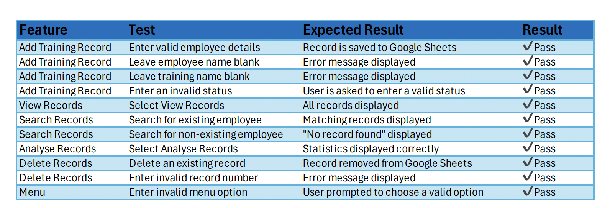
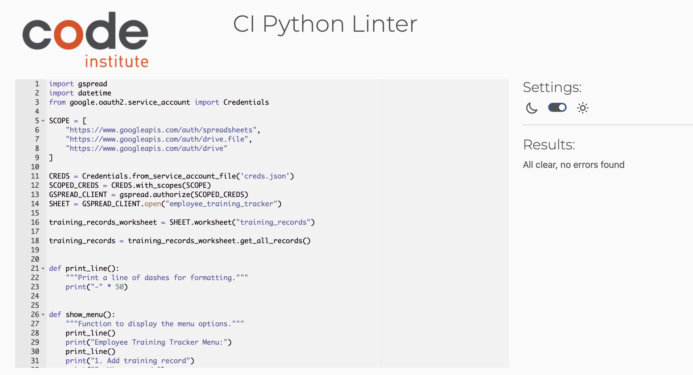
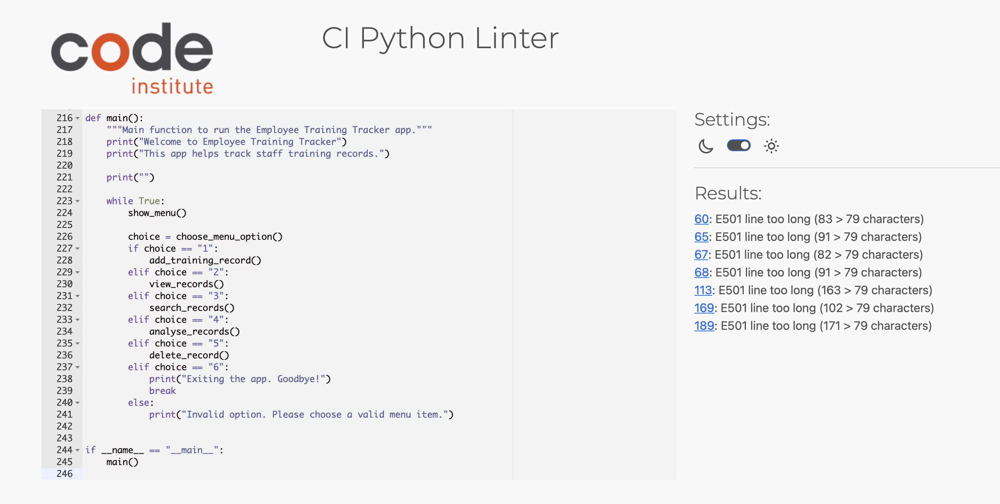
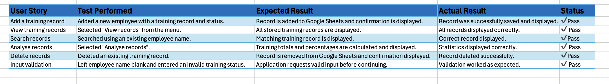

## Testing

### Manual Testing

The application was manually tested to ensure that all features functioned as expected. 
The following tests were completed:

The above screenshot demonstrated input validation and successful programme execusion.

### PEP8 Validation

The project was validated using the Code Institute PEP8 Python Linter throughout development.
During development, the application successfully passed the PEP8 validation with no errors.

During development, I attempted to resolve all PEP8 warnings. However, some of the changes 
made to fix line-length warnings caused the application to stop running correctly. To keep 
the final project stable and functional, I reverted back to the last working version of the code.

The final version contains minor line-length warnings, but these do not affect the functionality of the application. 
The application runs successfully.

### User Story Testing

The application was manually tested against each user story to ensure that all planned functionality 
worked as intended. The table below summarises the tests performed, the expected outcome, the actual 
result, and whether each user story passed.

#### Bugs Encountered and Fixes
During development, several issues were identified through manual testing and were successfully resolved.

- The application originally crashed if a user entered letters instead of a record number when deleting a training record. This was resolved by validating that the input contains only numeric values before converting it to an integer.

- Initially, users could enter blank employee names and training names. Input validation was added to ensure these fields cannot be left empty.

- Training status was originally free text, allowing inconsistent values to be stored. Validation was added so only **Completed**, **In Progress**, or **Not Started** can be entered.

- A bug occurred when deleting records because the incorrect Google Sheets method was used ('delete_row'). This was corrected by using the 'delete_rows()' method.

- Initially, users could enter a record number that did not exist when deleting records. Additional validation was implemented to ensure only displayed records can be deleted.

#### Remaining Bugs

No known bugs remain at the time of submission.
